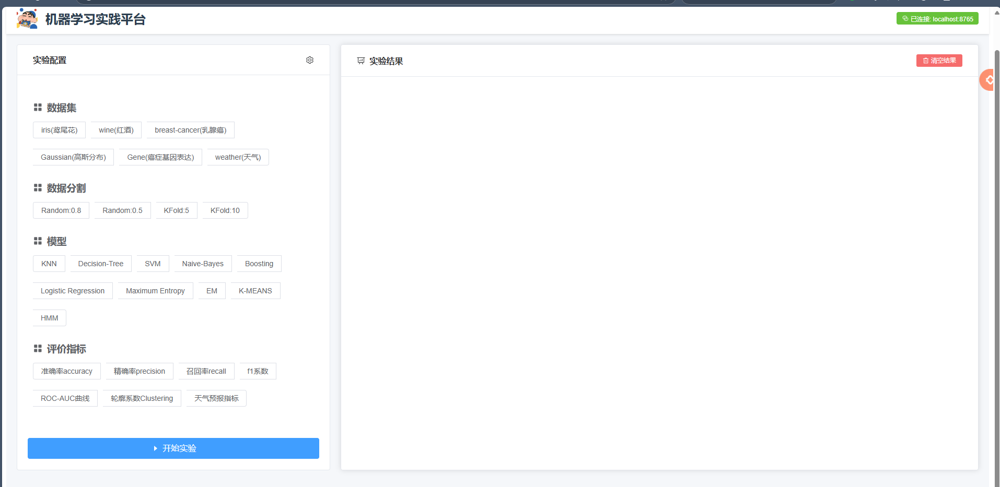

# 机器学习实践平台项目分析报告

202212033024 李煜均

[TOC]

## 1.项目简介


## 2.项目启动

### 2.1 项目环境

- Window11(X86)
- Anaconda3-Python 3.12

### 2.2 IDE

- Cursor
- Visual Studio Code
- WebStorm 2024.1.7

### 2.3 前端启动

```
cd dlframe-front-master

npm install
npm run dev
```

### 2.4 后端启动

```
cd dlframe-back/tests
python Display.py
```


## 3.项目整体架构

### 3.1 前后端分离架构


- 前端: dlframe-front-master (Vue 3 + TypeScript)
- 后端: dlframe-back (Python)
- 通信: WebSocket协议


### 3.2 技术栈

**前端:**

- Vue 3
- TypeScript
- Element Plus
- Vite

**后端:**

- Python
- WebSocket
- NumPy
- Pillow
- Sklearn
- Pytorch


## 4. 后端架构 (dlframe-back)

### 4.1 核心模块

**数据集**

```python
class IrisDataset:
    """
    创建一个鸢尾花分类数据集
    
    特征：
    - 4个数值特征：萼片长度、萼片宽度、花瓣长度、花瓣宽度
    - 所有特征值为浮点数
    
    分类：
    1. Setosa（山鸢尾）
    2. Versicolor（变色鸢尾）
    3. Virginica（维吉尼亚鸢尾）
    
    参数：
        无需参数，直接从sklearn加载
    """

class MNISTDataset:
    """
    创建一个手写数字识别数据集
    
    特征：
    - 784维向量（28x28像素图像展平）
    - 像素值范围0-1（归一化后）
    
    分类：
    - 10个类别（数字0-9）
    
    参数：
        无需参数，直接从openml加载
    """

    
class WineDataset:
    """
    创建一个葡萄酒分类数据集
    
    特征：
    - 13个化学成分指标
    - 包括酒精度、苹果酸、灰分等
    
    分类：
    - 3个不同品种的葡萄酒
    
    参数：
        无需参数，直接从sklearn加载
    """

class BreastCancerDataset:
    """
    创建一个乳腺癌诊断数据集
    
    特征：
    - 30个数值特征
    - 包括细胞核的各种特征测量值
    
    分类：
    1. 良性肿瘤
    2. 恶性肿瘤
    
    参数：
        无需参数，直接从sklearn加载
    """

class WeatherDataset:
    """
    创建一个天气-活动隐马尔可夫模型数据集
    
    特征：
    - 隐状态：晴天、雨天
    - 观测状态：散步、购物、清洁
    
    概率分布：
    1. 转移概率：天气状态转换概率
    2. 发射概率：不同天气下进行各项活动的概率
    
    参数：
        sequence_length: 生成序列的长度，默认2000
    """

class GMMDataset:
    """
    创建一个高斯混合模型聚类数据集
    
    特征：
    - 2维特征空间中的点
    - 来自多个高斯分布的混合
    
    聚类：
    - n_components个不同的高斯分布簇
    
    参数：
        n_samples: 样本数量，默认300
        n_components: 高斯分布的数量，默认3
        random_state: 随机种子，默认42
    """
    
 class GeneExpressionDataset:
    """
    创建一个简化的癌症基因表达数据集（二维特征用于可视化）
        
    特征：
    - 选择2个重要基因的表达水平
    - 每个基因的表达值范围在0-15之间
        
    癌症亚型：
    1. A型：CCND1高表达，CD8A低表达
    2. B型：CCND1低表达，CD8A高表达
    3. C型：CCND1和CD8A都处于中等水平
        
    参数:
        n_samples: 样本数量
        random_state: 随机种子
    """
```


**数据分割**

- RandomSplitter
- KFoldSplitter


**机器学习模型**

| KNN                     | Decision-Tree       | SVM    | Naive-Bayes | Boosting |
| ----------------------- | ------------------- | ------ | ----------- | -------- |
| **Logistic Regression** | **Maximum Entropy** | **EM** | **K-MEANS** | **HMM**  |


**评价指标**

- '准确率accuracy'
- '精确率precision'
- '召回率recall'
- 'f1系数'
- 'ROC-AUC曲线'
- '轮廓系数Clustering'
- '天气预报指标'


**数据可视化**

```python
def visualize(self , testDataset)
```


### 4.2 功能模块

计算节点系统 (CalculationNode.py)

通信管理 (WebManager.py)

日志系统 (Logger.py)

性能监控 (TimeWarpper.py)

递归处理 (RecursiveWarpper.py)


## 5. 前端架构 (dlframe-front-master)



### 5.1 核心组件

```html
<template>
  <el-container class="main-container">
    <!-- 顶部导航栏 -->
    <el-header>...</el-header>
    
    <!-- 主要内容区 -->
    <el-main>
      <!-- 配置面板 -->
      <!-- 结果展示 -->
    </el-main>
  </el-container>
</template>
```


### 5.2 功能模块

1. 配置管理

```js
interface DlFrameConfigInterface {
  [key: string]: string;
}
```

WebSocket通信

```is
const ws = new WebSocket(`ws://${connectUrl}:${connectPort}`)
```

**结果展示**

文本输出

图像显示

实时更新


## 6. 通信流程

**连接建立**

```html
// 前端发起连接
connect() {
  ws = new WebSocket(...)
}
```

**数据交互**

```python
# 后端处理
class CSManager:
    def _forward(self, pkt):
        # 消息转发处理
```

**消息类型**

overview: 配置信息

print: 文本输出

imshow: 图像显示


## 7.项目难点

### 7.1 HMM隐马尔可夫模型训练

hmm模型构建初期，存在预测准确率过低的问题，通过修改及调试矩阵参数，将准确率提升至80%+。

```python
class HMMModel:
    def __init__(self, n_states, n_observations):
        self.n_states = n_states
        self.n_observations = n_observations
        self.logger = Logger.get_logger('HMMModel')
        
        # 初始化模型参数
        self._initialize_parameters()
        
    def _initialize_parameters(self):
        """初始化模型参数"""
        # 使用更好的初始化策略
        self.A = np.random.dirichlet(np.ones(self.n_states) * 10, size=self.n_states)
        self.B = np.random.dirichlet(np.ones(self.n_observations) * 10, size=self.n_states)
        self.pi = np.random.dirichlet(np.ones(self.n_states) * 10)
        
    def _normalize(self, matrix):
        """归一化矩阵，避免数值下溢"""
        return matrix / (np.sum(matrix, axis=1, keepdims=True) + 1e-12)
    
    def forward(self, observations):
        """前向算法的向量化实现"""
        T = len(observations)
        alpha = np.zeros((T, self.n_states))
        scaling_factors = np.zeros(T)
        
        # 初始化
        alpha[0] = self.pi * self.B[:, observations[0]]
        scaling_factors[0] = np.sum(alpha[0])
        alpha[0] /= scaling_factors[0]
        
        # 递归计算
        for t in range(1, T):
            alpha[t] = np.dot(alpha[t-1], self.A) * self.B[:, observations[t]]
            scaling_factors[t] = np.sum(alpha[t])
            alpha[t] /= scaling_factors[t]
            
        return alpha, scaling_factors
    
    def backward(self, observations, scaling_factors):
        """后向算法的向量化实现"""
        T = len(observations)
        beta = np.zeros((T, self.n_states))
        
        # 初始化
        beta[-1] = 1 / scaling_factors[-1]
        
        # 递归计算
        for t in range(T-2, -1, -1):
            beta[t] = np.dot(self.A, (self.B[:, observations[t+1]] * beta[t+1]))
            beta[t] /= scaling_factors[t]
            
        return beta
    
    def train(self, trainDataset):
        """训练模型的包装方法"""
        try:
            # 提取观测序列
            observations = np.array([x[0] for x in trainDataset])
            
            # 训练型
            return self.train_internal(observations)
            
        except Exception as e:
            self.logger.print(f"训练过程中出现错误: {str(e)}")
            import traceback
            self.logger.print(traceback.format_exc())
            
    
    def _compute_xi(self, observations, alpha, beta):
        """计算xi矩阵"""
        T = len(observations)
        xi = np.zeros((T-1, self.n_states, self.n_states))
        
        for t in range(T-1):
            numerator = (alpha[t].reshape(-1, 1) * self.A * 
                        self.B[:, observations[t+1]].reshape(1, -1) * 
                        beta[t+1].reshape(1, -1))
            xi[t] = numerator / np.sum(numerator)
            
        return xi
        
    def _update_parameters(self, observations, gamma, xi):
        """更新模型参数"""
        # 更新初始概率
        self.pi = gamma[0]
        
        # 更新转移概率
        self.A = np.sum(xi, axis=0) / np.sum(gamma[:-1], axis=0).reshape(-1, 1)
        
        # 更新发射概率
        for j in range(self.n_states):
            for k in range(self.n_observations):
                self.B[j,k] = np.sum(gamma[observations == k, j]) / np.sum(gamma[:, j])
                
        # 归一化参数
        self.A = self._normalize(self.A)
        self.B = self._normalize(self.B)
        
    def predict(self, observations):
        """使用维特比算法进行预测"""
        T = len(observations)
        delta = np.zeros((T, self.n_states))
        psi = np.zeros((T, self.n_states), dtype=int)
        
        # 初始化
        delta[0] = np.log(self.pi) + np.log(self.B[:, observations[0]])
        
        # 递归
        for t in range(1, T):
            for j in range(self.n_states):
                temp = delta[t-1] + np.log(self.A[:, j])
                delta[t,j] = np.max(temp) + np.log(self.B[j, observations[t]])
                psi[t,j] = np.argmax(temp)
        
        # 回溯
        states = np.zeros(T, dtype=int)
        states[-1] = np.argmax(delta[-1])
        for t in range(T-2, -1, -1):
            states[t] = psi[t+1, states[t+1]]
            
        return states
    
```

### 7.2 数据可视化的传输

在创建数据可视化的过程中，由于self.logger.imshow()不支持matplotlib图像的直接传入，造成了无法在网页显示图像的情况，后续通过将matplotlib图像转换为np.array()数组解决了这一情况（下图以ROC-AUC曲线绘制为例）

```python
        # 绘制对角线
        plt.plot([0, 1], [0, 1], color='navy', lw=2, linestyle='--')
        plt.xlim([0.0, 1.0])
        plt.ylim([0.0, 1.05])
        plt.xlabel('假正率 (False Positive Rate)')
        plt.ylabel('真正率 (True Positive Rate)')
        plt.title('接收者操作特征(ROC)曲线')
        plt.legend(loc="lower right")
        
        # 将图像转换为数组格式
        buf = BytesIO()
        plt.savefig(buf, format='png', dpi=100, bbox_inches='tight')
        buf.seek(0)
        
        img = Image.open(buf)
        img = img.convert('RGB')
        img_array = np.array(img)
        
        plt.close()
        buf.close()
        
        # 使用logger显示图像数组
        self.logger.imshow(img_array)
```

### 7.3 前后端通信实现

通过WebSocket，实现了前后端通信的互联，将前端展示在http://localhost:3000/同时监听http://localhost:8765/的后端端口

```vue
const connect = () => {
  ws = new WebSocket('ws://' + connectUrl.value + ':' + connectPort.value)
  ws.onopen = () => {
    isConnectedToServer.value = true
    showConnectInfoWindow.value = false
    ElMessage({
      message: '连接成功',
      type: 'success',
    })
    ws?.send(JSON.stringify({
      'type': 'overview', 
      'params': {}
    }))
  }
```

```python
class WebManager(CalculationNodeManager):
    def __init__(self, host='0.0.0.0', port=8765, parallel=False) -> None:
        super().__init__(parallel=parallel)
        self.host = host
        self.port = port
```

### 7.4 前端界面优化

| 原前端界面                                 | 优化后前端界面                             |
| ------------------------------------------ | ------------------------------------------ |
|  |  |

**组件结构**：

- 使用了 `<template>` 标签包裹所有的模板代码，定义了组件的结构和布局。

**顶部导航栏**：

- `<el-header>`：这是 Element Plus 组件库中的一个组件，用于创建页面的头部。
- `<div class="header-content">`：这个 div 包含了logo和连接状态信息。
- ``：显示了一个图标，作为平台的标识。
- `<h1>机器学习实践平台</h1>`：页面的主标题，描述了这个平台的功能。
- `<el-tag>`：在这里用来显示当前的连接状态，包含连接的URL和端口。

**连接状态**：

- 连接状态通过 `{{connectUrl}}:{{connectPort}}` 动态绑定到数据模型，实时更新连接信息。
- `<el-icon><Connection /></el-icon>`：提供一个图标显示连接状态，`Connection` 是一个从 Element Plus 图标库引入的图标组件。

**左侧配置面板**：

- `<el-col :span="8">`：该列占据总宽度的 8 个单位（在 24 格布局中），用于显示实验配置的内容。
- `<el-card>`：卡片组件，提供了一个可用来显示实验配置的区域。

**卡片头部**：

- 使用了带有插槽的 `<template #header>` 定义了卡片的头部内容。包含了一些有关实验配置的标题和工具提示。
- `<el-tooltip>`：为设置图标提供了一个工具提示，描述了图标的功能（配置实验参数）。


## 8. 特色功能

### 8.1 实时数据可视化

支持文本和图像实时显示

动态更新实验结果

### 8.2 灵活的配置系统

动态加载实验参数

实时验证配置有效性

### 8.3 多种数据集支持

标准机器学习数据集

自定义数据集接口


## 9. 项目优势

**架构设计**

- 清晰的模块划分
- 良好的扩展性
- 松耦合的组件设计

**用户体验**

- 直观的界面设计

- 实时反馈

- 错误提示

- 功能完整性

- 支持多种实验场景

- 完整的数据处理流程

- 数据可视化的展现


## 10. 改进建议

### 10.1 后端改进

- 添加数据持久化
- 实现可视化展示与否选择
- 增加并发处理能力
- 完善错误处理机制
- 添加单元测试

### 10.2 前端改进

- 优化大数据量展示
- 添加更多可视化组件
- 实现配置模板功能
- 增强响应式设计

### 10.3 整体改进

- 添加用户认证系统
- 实现实验结果保存功能
- 支持更多数据格式
- 优化通信协议


